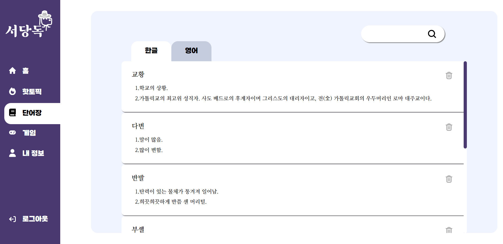
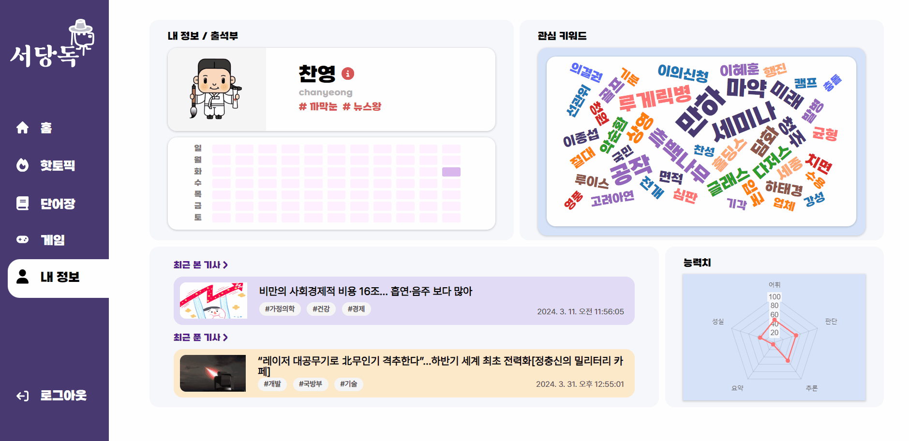
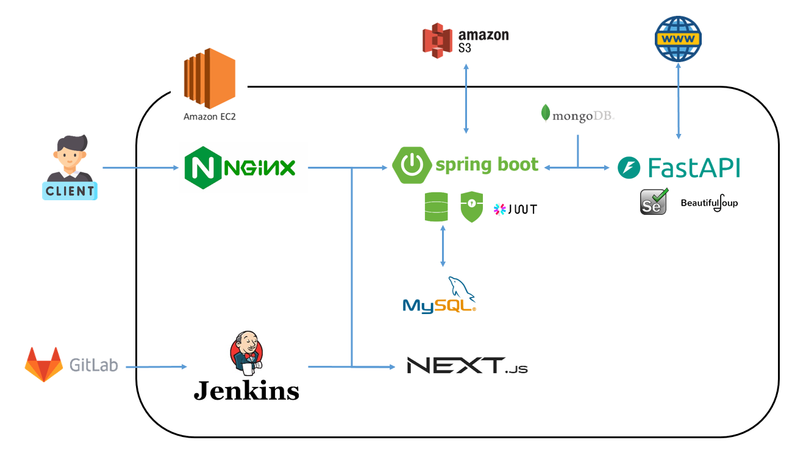
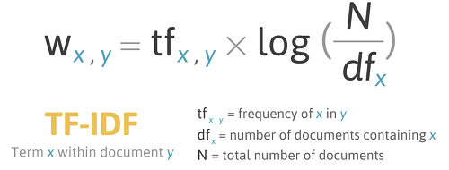
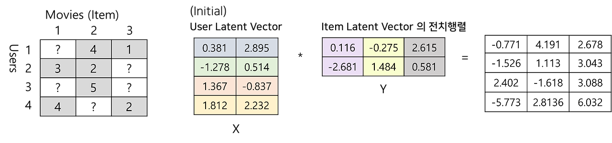

# 📰 서당독


## 📜 목차
1. 프로젝트 소개
2. 서비스 화면
3. 주요 기능
4. 개발 환경
5. 시스템 아키텍처
6. 기술 특이점
7. Conventions
8. 팀원 소개

# 🌟 프로젝트 소개
> 키워드 기반으로 추천 받은 뉴스 기사를 통해 문해력을 높일 수 있는 웹 서비스

## 🎞️ UCC
[](https://www.youtube.com/watch?v=3mPX0aQhI00) 

# 👀 서비스 화면
### 랜딩 페이지
- 서비스의 주요 기능에 대한 소개


### 회원가입 & 로그인
- 관심 있는 키워드 선택
- 키워드 새로고침


### 홈
- 회원가입 시 선택한 키워드에 따른 ```맞춤형 뉴스 기사``` 추천 제공
- 키워드에 맞는 뉴스 기사를 추천해주는 ```내 취향 뉴스``` 제공
- 비슷한 취향을 가진 사용자의 뉴스 기사를 추천해주는 ```다른 사람 뉴스``` 제공
- 새로고침으로 새로운 뉴스 기사 추천


### 핫토픽
- 서비스 내 <b>조회수</b>가 많은 뉴스 기사를 보여주는 ```많이 본 뉴스``` 제공
- 서비스 내 <b>풀이수</b>가 많은 뉴스 기사를 보여주는 ```많이 푼 뉴스``` 제공


### 기사 상세 보기
- 뉴스 기사의 ```키워드``` 제공
- 본문 내용 ```하이라이트``` 제공
- 단어를 클릭해 ```단어의 의미```를 제공하고 ```단어장 저장``` 가능
- 뉴스 기사의 내용으로 ```뉴스 기사 문제``` 제공
- 결과 화면에서 ```네이버 요약봇의 요약문``` 제공


### 단어장 & 스피드 퀴즈
- ```기사 상세 보기```에서 저장한 단어
- 단어를 클릭하여 ```상세 보기``` 제공
- 저장한 단어들로 ```스피드 퀴즈``` 제공


### 내 정보
- 서비스를 사용하며 해금되는 ```캐릭터 뱃지``` 제공
- 문제를 풀면 칠해지는 ```스트릭``` 제공
- 사용자의 관심도를 나타내는 ```관심 키워드``` 제공
- ```최근 본 기사```와 ```최근 푼 기사``` 내역 제공
- 문제 풀이의 정답률과 출석률에 따른 ```능력치``` 제공


# 주요 기능
- 사용자의 관심 키워드에 맞는 뉴스 기사 추천 제공
    - 콘텐츠 기반 필터링 방식의 ```내 취향 뉴스```
    - 협업 필터링 방식의 ```다른 사람 뉴스```
    - 새로운 뉴스를 추천 받는 ```새로 고침```
    - 조회수와 풀이수가 높은 핫토픽 기사 목록 제공
- 뉴스 기사 본문을 이해하기 위한 기능 제공    
    - ```하이라이트```의 저장과 삭제
    - 클릭하여 ```단어 의미 검색```
- 뉴스 기사 문제 제공
    - 뉴스 기사의 본문 내용에 따른 GPT 자동 생성 ```뉴스 기사 문제``` 제공
    - 네이버 요약봇의 ```요약문``` 제공
- 어휘력을 기르기 위한 기능 제공
    - ```단어장``` 저장
    - ```스피드 퀴즈```
- 서비스 사용 기록을 확인할 수 있는 내 정보 제공
    - ```캐릭터 뱃지```
    - ```관심 키워드```
    - ```최근 본 기사``` 내역
    - ```출석률```

# 개발 환경
- 이슈 관리: Jira
- 형상 관리: Gitlab
- 빌드/배포 관리: Jenkins
- 커뮤니케이션: Mattermost, Notion, Discord
- 디자인: Figma
- IDE
  - Visual Studio Code 1.85.1
  - IntelliJ IDEA 2023.03.02 (Community Edition)
  - PyCharm IDE 2023.03.02 (Community Edition)
- 서버: AWS EC2
  - Ubuntu 20.04 LTS
  - Nginx 1.18.0
  - OpenSSL 1.1.1f
- Front-End
  - Node.js 20.11.1
  - Next.js 14.1.0
- Back-End
  - Java 17 (Azul Zulu version 17.48.15)
  - Spring boot 3.2.4
  - Python 3.11.0
  - scikit-learn 1.4.1
  - konlpy 0.6.0
  - pandas 2.2.1
  - MySQL 8.0.36
  - MongoDB 7.0.6

# 시스템 아키텍쳐


# 기술 특이점
- 뉴스 기사에서 ```키워드 추출```
    - 전처리 후 TF-IDF를 사용하여 단어의 중요도 추출
     
- ```콘텐츠 기반 필터링``` 추천
    - 사용자의 키워드와 뉴스의 키워드를 벡터화하여 코사인 유사도 계산
    
- ```협업 필터링``` 추천
    - 사용자와 뉴스 간의 연관도를 분석하여 추천 진행
    
- 뉴스 기사 본문 ```하이라이트```
- GPT API를 사용하여 문제 생성
- 10개의 언론사에서 매일 기사 수집

# 팀원 소개
| 이름                                          | 역할       | 담당                                                 |
| --------------------------------------------- | ---------- | ---------------------------------------------------- |
| [박찬영](https://github.com/Park-chan-00)     | 팀장, 백엔드   | 크롤링, 추천 시스템, 자연어 처리, 뉴스 문제 생성 자동화, 디자인           |
| [김창희](https://github.com/changhi97)     | 백엔드   | 추천 시스템 총괄, DB 설계, API 설계           |
| [김아림](https://github.com/arim-kim)     | CI/CD   | DB 설계, API 설계, API 키 관리, EC2 서버 관리, CI/CD, UI/UX 설계, UCC 제작           |
| [정창휘](https://github.com/JungChnagHwi)     | 백엔드   | API 설계,  DB 설계, UI/UX 설계, 디자인           |
| [위재원](https://github.com/jaewonwi)     | 백엔드   |  API 설계,  DB 설계, 협업 툴 관리       |
| [양윤모](https://github.com/momo-abcd)     | 프론트엔드   |  UI/UX 설계 총괄, 디자인       |
