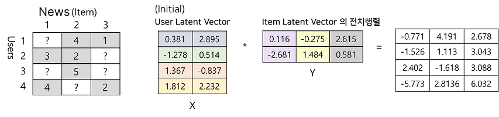

# 📰 서당독


## 📜 목차
1. 프로젝트 소개
2. 서비스 화면
3. 주요 기능
4. 개발 환경
5. 시스템 아키텍처
6. 기술 특이점
7. Conventions
8. 팀원 소개

<br/>

# 🌟 프로젝트 소개
'심심한 사과' 논란을 들어보신 적 있나요?  
이 밖에도 '사흘', '금일'과 같은 말들을 모르는 젊은 세대가 증가하고 있으며,
현대인의 절반이상이 문해력 부족으로 업무상 어려움을 겪은 적이 있다고 대답한 조사 결과도 있습니다.  
이처럼 **문해력** 부족 문제는 중요한 사회 이슈 중 하나입니다.  

저희는 이러한 문해력 부족 문제를 해결하기 위한 고민 끝에 서당독을 제작하게 되었습니다.  
서당독은 **관심키워드** 기반으로 **뉴스**를 **추천**하고 이를 통해 문해력을 높일 수 있는 웹 서비스입니다.

## 🎞️ UCC
[](https://www.youtube.com/watch?v=3mPX0aQhI00) 

<br/>

# 👀 서비스 화면
## 랜딩 페이지
- 서비스의 주요 기능에 대한 소개


## 회원가입 & 로그인
- 관심 있는 키워드 선택 후 회원가입
- 키워드 새로고침으로 새로운 키워드 불러오기 가능


## 홈
- 회원가입 시 선택한 키워드와 사용자 활동에 따른 ```맞춤형 뉴스 추천```
  - 관심 키워드에 맞는 사용자 취향의 뉴스를 추천해주는 ```내 취향 뉴스```
  - 비슷한 취향을 가진 사용자의 뉴스를 추천해주는 ```다른 사람 뉴스```
- ```새로고침```으로 새로운 뉴스 기사 추천


## 핫토픽
- 서비스 내 <b>조회수</b>가 많은 뉴스를 보여주는 ```많이 본 뉴스``` 
- 서비스 내 <b>풀이수</b>가 많은 뉴스를 보여주는 ```많이 푼 뉴스``` 


## 뉴스 상세 보기
- 뉴스 본문에서 추출한 주요 ```키워드``` 
- 뉴스를 표시하면서 읽을 수 있는 ```하이라이트``` 기능 제공
- 단어를 클릭하여 ```단어의 의미```를 볼 수 있고, 단어를 ```단어장```에 저장 가능
- 뉴스의 내용을 바탕으로 이해도를 체크하기 위한 ```문제 및 요약하기``` 제공
- 문제를 풀고난 후 ```정답 채점``` 및 ```네이버 요약봇의 요약문```과의 비교 가능


## 단어장 & 스피드 퀴즈
- ```뉴스 상세 보기```에서 저장한 단어들을 단어장에서 관리
- 단어를 클릭하면 ```단어 상세 보기``` 가능
- 저장한 단어들로 ```스피드 퀴즈``` 게임 제공


## 내 정보
- 서비스를 사용하며 조건을 달성하면 해금되는 ```캐릭터 뱃지```
- 서비스에 들어와 문제를 푼 날짜를 볼 수 있는 ```출석부```
- 사용자가 관심있는 키워드를 모아 표시하는 ```관심 키워드```
- ```최근 본 기사```와 ```최근 푼 기사``` 내역 제공
- 문제 풀이의 정답률과 출석률에 따른 ```능력치``` 제공


<br/>

# ✨ 주요 기능
- 사용자의 관심 키워드에 맞는 뉴스 기사 추천 제공
    - 콘텐츠 기반 필터링 방식의 ```내 취향 뉴스```
    - 협업 필터링 방식의 ```다른 사람 뉴스```
    - 새로운 뉴스를 추천 받는 ```새로 고침```
    - 조회수와 풀이수가 높은 핫토픽 기사 목록 제공
- 뉴스 기사 본문을 이해하기 위한 기능 제공    
    - ```하이라이트```의 저장과 삭제
    - 클릭하여 ```단어 의미 검색```
- 뉴스 기사 문제 제공
    - 뉴스 기사의 본문 내용에 따른 GPT 자동 생성 ```뉴스 기사 문제``` 제공
    - 네이버 요약봇의 ```요약문``` 제공
- 어휘력을 기르기 위한 기능 제공
    - ```단어장``` 저장
    - ```스피드 퀴즈```
- 서비스 사용 기록을 확인할 수 있는 내 정보 제공
    - ```캐릭터 뱃지```
    - ```관심 키워드```
    - ```최근 본 기사``` 내역
    - ```출석률```

<br/>

# 🖥️ 개발 환경
- 이슈 관리: Jira
- 형상 관리: Gitlab
- 빌드/배포 관리: Jenkins
- 커뮤니케이션: Mattermost, Notion, Discord
- 디자인: Figma
- IDE
  - Visual Studio Code ```1.85.1```
  - IntelliJ IDEA 2023.03.02 (Community Edition)
  - PyCharm IDE 2023.03.02 (Community Edition)
- 서버: AWS EC2
  - Ubuntu ```20.04 LTS```
  - Nginx ```1.18.0```
  - OpenSSL ```1.1.1f```
- Front-End
  - Node.js ```20.11.1```
  - Next.js ```14.1.0```
- Back-End
  - Java ```17``` (Azul Zulu version 17.48.15)
  - Spring boot ```3.2.4```
  - Python ```3.11.0```
  - scikit-learn ```1.4.1```
  - konlpy ```0.6.0```
  - pandas ```2.2.1```
  - MySQL ```8.0.36```
  - MongoDB ```7.0.6```

<br/>

# 시스템 아키텍쳐


<br/>

# 기술 특이점
- 뉴스 기사에서 ```키워드 추출```
    - 전처리 후 TF-IDF를 사용하여 단어의 중요도 추출

 

- ```콘텐츠 기반 필터링``` 추천
    - 사용자의 키워드와 뉴스의 키워드를 벡터화하여 코사인 유사도 계산


- ```협업 필터링``` 추천
    - 사용자와 뉴스 간의 연관도를 분석하여 추천 진행



- 뉴스 기사 본문 ```하이라이트```
- GPT API를 사용하여 문제 생성
- 10개의 언론사에서 매일 기사 수집

<br/>

# 팀원 소개
| 이름                                          | 역할       | 담당                                                 |
| --------------------------------------------- | ---------- | ---------------------------------------------------- |
| [박찬영](https://github.com/Park-chan-00)     | 팀장, 백엔드   | 크롤링, 추천 시스템, 자연어 처리, 뉴스 문제 생성 자동화, 디자인           |
| [김창희](https://github.com/changhi97)     | 백엔드   | 추천 시스템 총괄, DB 설계, API 설계           |
| [김아림](https://github.com/arim-kim)     | CI/CD   | DB 설계, API 설계, API 키 관리, EC2 서버 관리, CI/CD, UI/UX 설계, UCC 제작           |
| [정창휘](https://github.com/JungChnagHwi)     | 백엔드   | API 설계,  DB 설계, UI/UX 설계, 디자인           |
| [위재원](https://github.com/jaewonwi)     | 백엔드   |   DB 설계, 뉴스 상세보기, 뉴스 문제풀이, 뉴스 키워드 가중치, 마이페이지 API 설계        |
| [양윤모](https://github.com/momo-abcd)     | 프론트엔드   |  UI/UX 설계 총괄, 디자인       |
